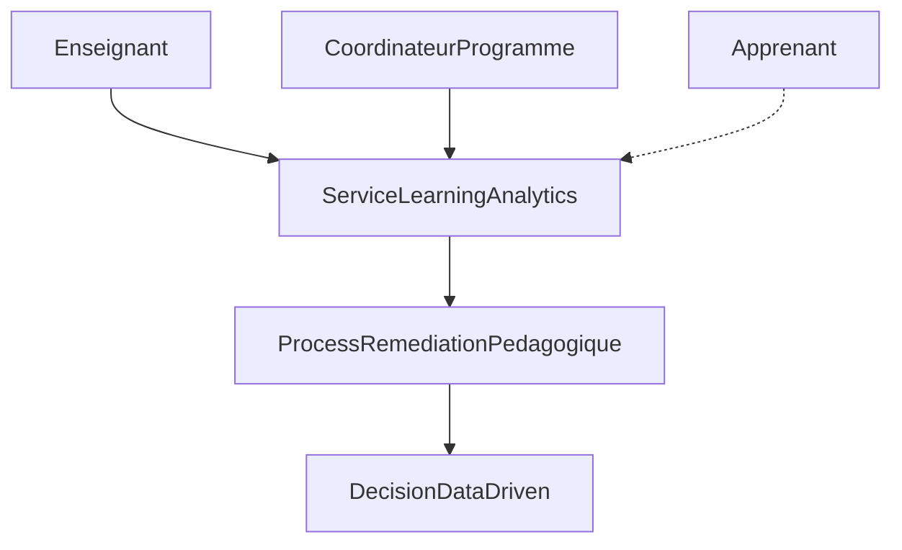
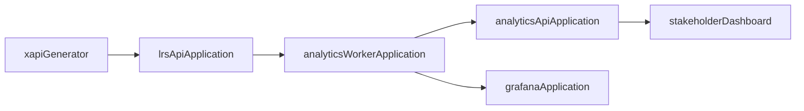
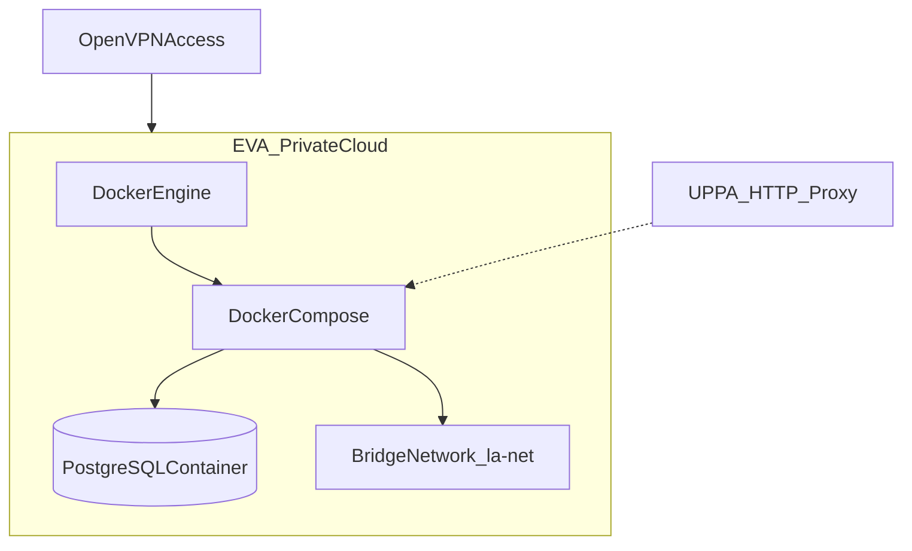

# ArchiMate — Learning Analytics Platform

Trois couches (Business / Application / Technology). Diagrammes Mermaid exportables en PNG pour le rapport.

## Business layer

## Application layer

## Technology layer

## Notes de modélisation
- Business service = offre SaaS analytics
- Application components = microservices du Compose
- Nodes/devices = LXC EVA `m1-siglis-cc-03` + Docker Engine
